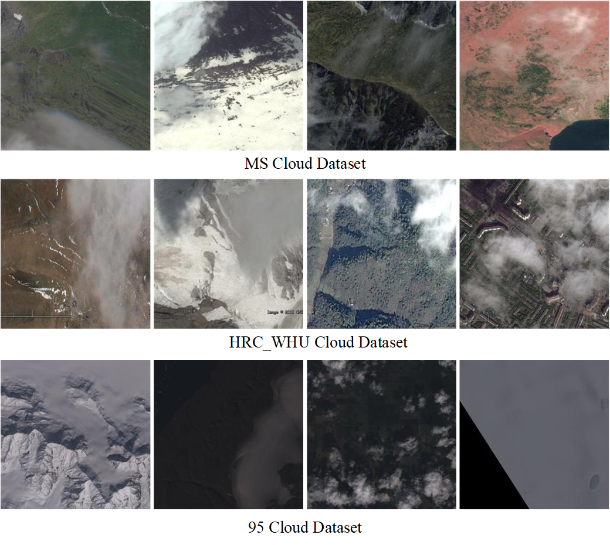
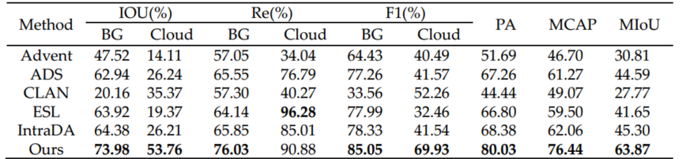
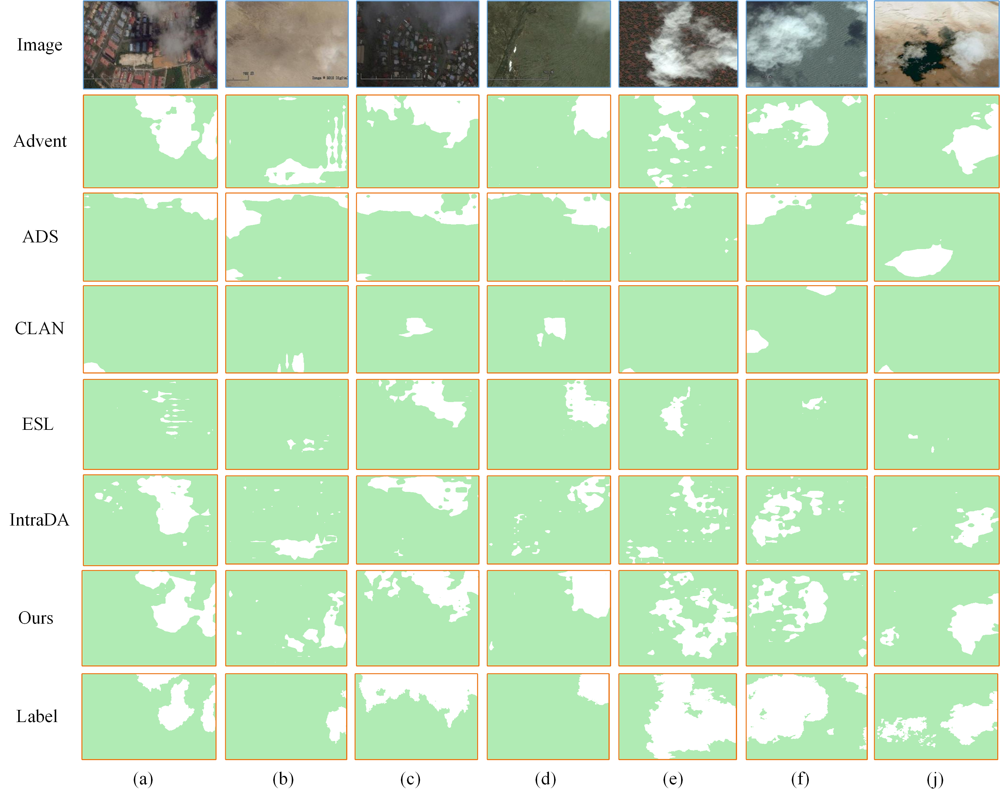
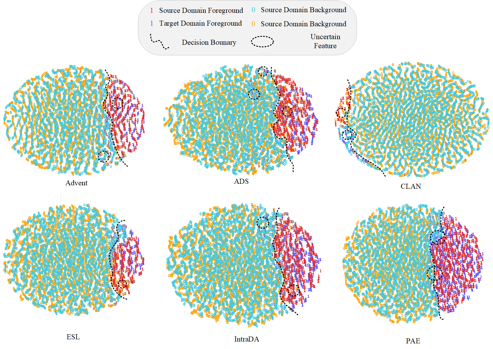

# 🎆ASDA: An Anchor Self-guided Domain Adaptation Method for Cross-spatiotemporal Cloud Detection in High-resolution Remote Sensing Images 🎆

**This repository contains the official Pytorch implementation of training & evaluation code for** [[ASDA](http://github.com/gasking/ASDA)]🔥

<div align="center">
  
</div>
<p align="center">
  Figure 1: Overview of ASDA overall framework.(UP: Upsampling, FC: Fully Connection, Stop Grad: Parameters are not updated by gradient)
</p>

## Abstract:
**Global cloud detection tasks are crucial to generate high-quality satellite remote sensing images. Due to the large difference in data distribution between the source domain and the target domain, cloud detection based on deep learning cannot achieve satisfactory results in scenarios that change across time and space. At present, self-supervised domain adaptation based on pseudo-label prior information can effectively enhance the generalization ability of the model. However, the self-supervised method is too sensitive to the category information. It is easy to bias to multi-class features in the sample data for optimization, resulting in a lot of noise in the pseudo-label, and the model tends to be negatively optimized. In order to solve the above problems, we propose an anchor-guided cross-spatio-temporal domain adaptation method for high-resolution imagery cloud detection (ASDA). Firstly, an anchor self-guidance method is proposed to improve the quality of pseudo-label generation using the pre-trained inter-domain segmentation model and the in-domain student model. Specifically, the inter-domain segmentation model can express the data distribution characteristics of the original overall source and target domains and align the source and target domains globally. The student model performs self-supervised training and adversarial training in the domain to further align the local feature distribution from within the domain. Then, to further optimize the quality of pseudo-labels, High-Entropy contrast Loss and feature consistency loss are proposed. The High-Entropy further mines the reliable category features of the pseudo-label by encouraging the positive sample pairs in the high entropy region to remain compact and the negative sample pairs to stay away from each other. Finally, the feature consistency loss performs feature consistency mutual constraints on the multi-scale segmentation features, which further reduces the uncertainty region of the high entropy region. Through the generation and optimization strategy of high-quality pseudo-labels, the accuracy of self-supervised training is improved, so as to enhance the robustness of cross-domain representation of the model. The cross-domain adaptation experiments are carried out on three cloud segmentation datasets: MS cloud, HRC_WHU cloud and 95 Cloud. The results show that our method has obvious advantages in accuracy compared with other mainstream methods. Our proposed method provides a new idea for future research on domain adaptation of cloud segmentation for remote sensing images. The code is open source, the address is: https://github.com/gasking/ASDA.**


## Installation
We use [Pytorch2.1.1 + CUDA11.8] as  a software configuration environment.
### Environment Installation
```
conda create -n ASDA python=3.8
conda activate ASDA
conda install pytorch torchvision torchaudio cudatoolkit -c pytorch

pip config set global.index_url=http://mirrors.aliyun.com/pypi/simple/
pip install numpy==1.24.4
pip install Pillow==9.3.0
tensorboardX==2.6.2.2
```

## Dataset 
- MS Cloud Dataset: https://drive.google.com/file/d/15YE5OVRV8CbRU5RwrUOhq9RlbWZ6ifYO/view?usp=sharing
- HRC_WHU Cloud Dataset: http://gpcv.whu.edu.cn/data/WHU_Cloud_Dataset.html
- l95 Cloud Dataset: https://github.com/SorourMo/95-Cloud-An-Extension-to-38-Cloud-Dataset

<div align="center">
  
</div>
<p align="center">
  Dataset Description
</p>

## Results
### MS Cloud -> HRC_WHU Cloud 
* ***Quantitative analysis results of various methods in MS Cloud ->HRC_WHU cross-domain data set, the results are displayed in %; The last is listed as the average IoU. BOLD VALUES INDICATE THE BEST RESULTS***
<div align="center">
  
</div>
<p align="center">
  Quantitative analysis results of various methods in MS Cloud ->HRC_WHU cross-domain data set, the results are displayed in %; The last is listed as the average IoU. BOLD VALUES INDICATE THE BEST RESULTS
</p>
*  ***MS Cloud -> HRC_WHU cross-domain visualization result Green: BackGround; White: Cloud)***
<div align="center">
  
</div>
<p align="center">
  MS Cloud -> HRC_WHU cross-domain visualization result Green: BackGround; White: Cloud)
</p>

### HRC_WHU -> 95 Cloud
* ***Quantitative analysis results of various methods in HRC_WHU -> 95Cloud cross-domain data set, the results are displayed in %; The last is listed as the average IoU. BOLD VALUES INDICATE THE BEST RESULTS.***
<div align="center">
  
</div>
<p align="center">
  Quantitative analysis results of various methods in HRC_WHU -> 95Cloud cross-domain data set, the results are displayed in %; The last is listed as the average IoU. BOLD VALUES INDICATE THE BEST RESULTS.
</p>
* ***HRC_WHU -> 95 Cloud cross-domain Entropy visualization result.(Yellow: Reliable region; Red: Unreliable region)***
<div align="center">
  
</div>
<p align="center">
 HRC_WHU -> 95 Cloud cross-domain Entropy visualization result.(Yellow: Reliable region; Red: Unreliable region)
</p>

## T-SNE Visualize
<div align="center">
  
</div>
<p align="center">
 The T-SNE was used to visualize the segmentation performance of the experimental comparison method and ASDA adaptation task in MS Cloud ->HRC_WHU domain
</p>

## Training
### The training file, after the mid-draft, will be open for readers to access for validation
* **Check out bash.sh for training file configuration**
  * ***Step1 : The teacher model is trained for pseudo-label generation***
  * ***Step2: Split the in-domain samples accrding to the entropy value***
  * ***Step3: Unsupervised in-domain trainin***


## Test
* **Check out eval.sh for test file configuration**
  * ***Mask visualization***
  * ***T-SNE visualization***
  * ***Grad-CAM visualization***
  * ***Entropy Map visualization***

## License
 The code is released under the MIT license[](https://opensource.org/licenses/MIT).

## Relevant Projects
* **[1] Semi-Supervised Semantic Segmentation Using Unreliable Pseudo-Labels  - CVPR [[arXiv](https://link.zhihu.com/?target=https%3A//arxiv.org/pdf/2203.03884.pdf) [code](https://github.com/Haochen-Wang409/U2PL)]*** 
* **[2] Semantic distribution-aware contrastive adaptation for semantic segmentation  - IEEE TRANSACTIONS ON PATTERN ANALYSIS AND MACHINE INTELLIGENCE*** [**[arXiv](https://arxiv.org/abs/2105.05013) [code](https://github.com/BIT-DA/SDCA)**]

- ***Thanks for their nice contribution.***
