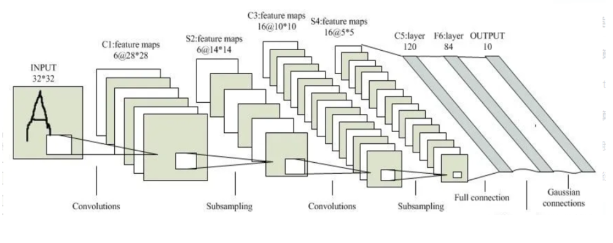
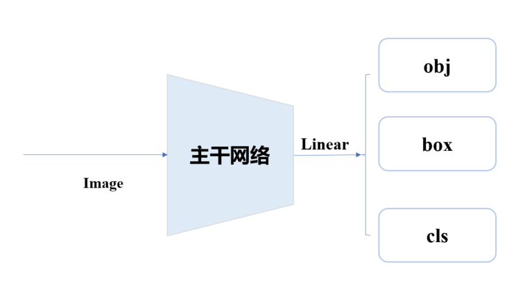
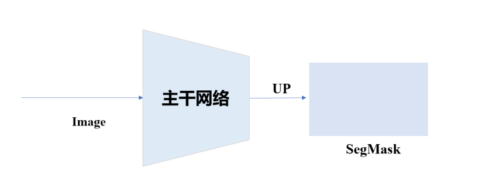
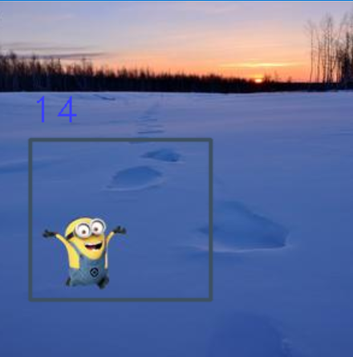
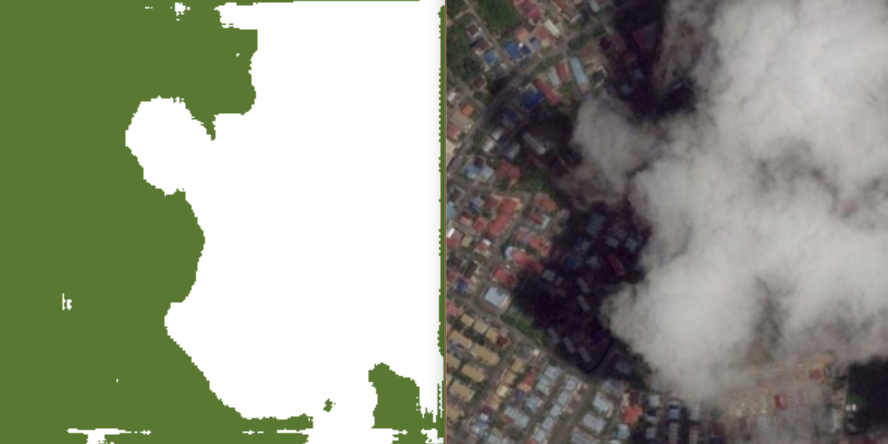

## 🎆 OD & Seg: This is a simple example in order to better understand CNN theory and some encoding idea. 🎆

### In order to more intuitively understand what the neural network is doing, Lenet is used for OD&Seg tasks and the last fully connected layer is removed.
* 

### OD task structure 
* 

### Seg task structure
* 

### In these two tasks, as od task is single target detection, we need to judge whether the current image contains the target, the location of the target and the category information of the target.
* **For whether there is a target, reduce to 0-1, and then calculate the binary loss.**
* **For the loss of the regression box, we only calculate the positive sample (i.e. there is a target in the image), in this task we scale to 0-1, also using binary loss, but this is not an optimal choice. A suitable encoding format can be found and the mean square error loss MSE is adopted.**
* **For classification losses, binary classification losses are directly calculated for all samples.**

* 

### For seg tasks, direct upsampling is N times, since BCEloss and Dice loss are adopted for binary classification tasks.
* 

#### 对于Seg任务，我们可以查看generate_seg.py文件。修改文件路径，并将原始图像存放在images中，掩码图像存放在labels中。

#### How to work?
* **<u>predict.py can be used to detect Minion, weight file location logs_od.</u>**
* <u>**predict_seg.py can be used to detect Minion, weight file location logs_seg.**</u>
* **pip install -r requirements.txt -i https:mirrors.aliyun.com/pypi/simple**

